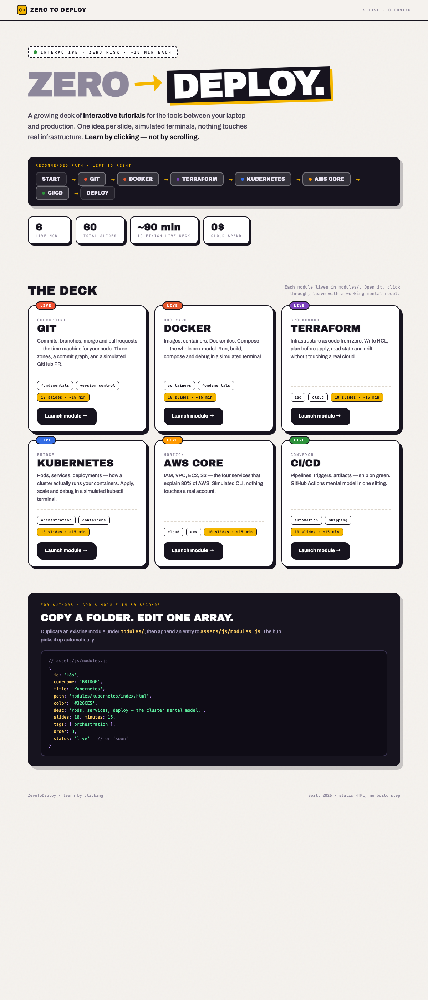

# ZeroToDeploy

Interactive DevOps tutorials you **learn by clicking** — not by scrolling.

Each module is a self-contained slide deck with simulated terminals. Zero cloud spend. Open `index.html` and pick a deck.

<p align="center">
  
</p>

## Project structure

```
ZeroToDeploy/
├── index.html              # Landing hub
├── assets/
│   ├── brand/              # logo.svg, favicon.svg
│   ├── css/                # hub.css, deck-base.css
│   └── js/                 # modules.js, hub.js, deck-engine.js
├── modules/
│   ├── git/                # CHECKPOINT
│   ├── docker/             # DOCKYARD
│   ├── terraform/          # GROUNDWORK
│   ├── kubernetes/         # BRIDGE
│   ├── aws/                # HORIZON
│   └── cicd/               # CONVEYOR
└── docs/screenshot.png
```

## Live modules

| Codename | Topic | Path | Time |
|----------|-------|------|------|
| **CHECKPOINT** | Git & GitHub | [`modules/git/index.html`](modules/git/index.html) | ~15 min · 10 slides |
| **DOCKYARD** | Docker | [`modules/docker/index.html`](modules/docker/index.html) | ~15 min · 10 slides |
| **GROUNDWORK** | Terraform | [`modules/terraform/index.html`](modules/terraform/index.html) | ~15 min · 10 slides |
| **BRIDGE** | Kubernetes | [`modules/kubernetes/index.html`](modules/kubernetes/index.html) | ~15 min · 10 slides |
| **HORIZON** | AWS Core | [`modules/aws/index.html`](modules/aws/index.html) | ~15 min · 10 slides |
| **CONVEYOR** | CI/CD | [`modules/cicd/index.html`](modules/cicd/index.html) | ~15 min · 10 slides |

## Recommended path

Git → Docker → Terraform → Kubernetes → AWS → CI/CD → Deploy

## Quick start

```bash
open index.html

# or serve locally (recommended — links work reliably)
python3 -m http.server 8080
# visit http://localhost:8080
```

Module links point to `index.html` explicitly so they work when opening files directly (`file://`) without a web server.

## Add a new module

1. Copy `modules/docker/` to `modules/your-topic/`.
2. Edit `slides.js`, `theme.css`, and set `--accent` in theme.
3. Add an entry to [`assets/js/modules.js`](assets/js/modules.js) with `path: 'modules/your-topic/index.html'`.

## Philosophy

- **One folder per topic** — shared engine, unique slides
- **Simulated, not real** — nothing breaks, nothing bills
- **Mental models first** — leave with the working model, not a certificate
